# Proyecto Final · E-commerce con Spring Boot y Kafka

## Autor
Judith Quelca - Curso Spring Boot & Kafka

## REPOSITORIOS
- ecommerce-product-service (9495)

https://github.com/judithquelca/ecommerce-product-service

- ecommerce-ecommerce-order-service (8081)

https://github.com/judithquelca/ecommerce-order-service

- ecommerce-inventory-service (8082)

https://github.com/judithquelca/ecommerce-inventory-service

### 3.1 Documentación (25 pts)

- README raíz con: propósito breve, diagrama sencillo, stack usado, requisitos previos, pasos exactos para compilar/ejecutar, tabla de endpoints, flujo Kafka, modelo de datos, enlace a Postman.
- Carpeta `postman/` con la colección actualizada.
- Evidencias visuales: capturas de Docker/Kafka, logs de consumo, screenshot de Postman o CLI.
- Si tienes configuraciones especiales (perfiles, variables, scripts), documenta el comando exacto.

### 3.2 Arquitectura y estructura (20 pts)

- Tres microservicios obligatorios: `product-service`, `order-service`, `inventory-service`.
- Paquetes base con tu dominio (`com.tuempresa.productservice`, etc.).
- Capas mínimas en cada servicio:
  - `controller`, `service`, `repository`, `model`, `dto`, `mapper`, `exception`, `kafka`.
- Archivos de configuración en `src/main/resources` (`application.yml`, `application-dev.yml`, `application-prod.yml`, `ValidationMessages.properties`).

### Arquitectura y estructura

#### Capas de cada servicio

- product-service

 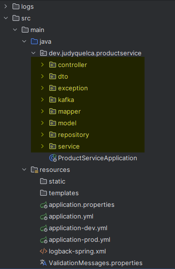

- order-service

 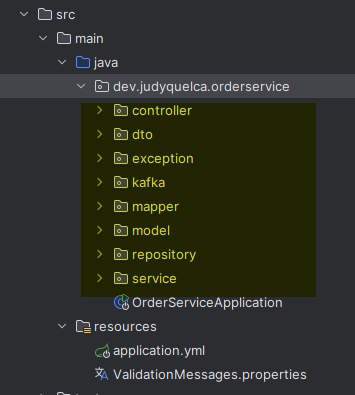

- inventory-service

 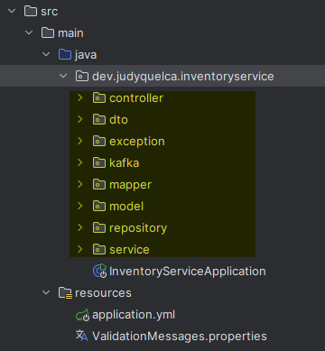


#### Archivos de configuración
- Los archivos de configuración que se tiene son los siguientes:
  - application.yml
  - application-dev.yml
  - application-prod.yml
  - ValidationMessages.properties

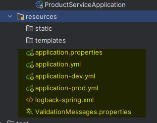

- Configuración de variables de entorno
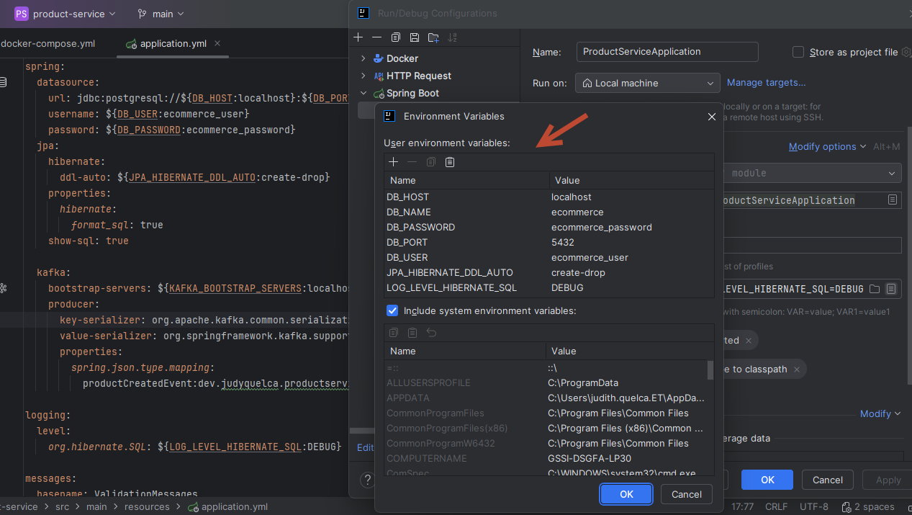

- Entorno de desarrollo
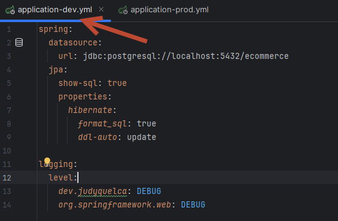

- Entorno de producción
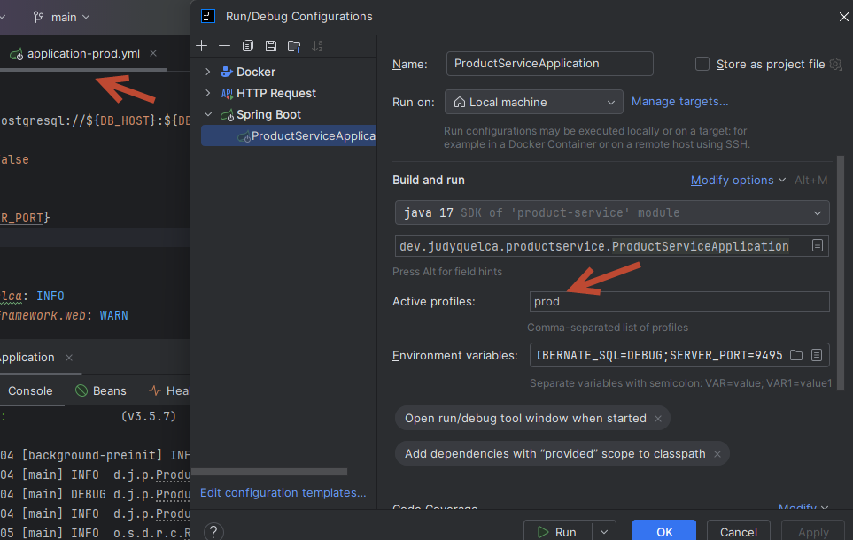

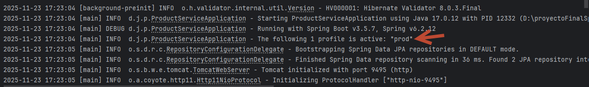

### Funcionalidad REST y validaciones

- **product-service**: CRUD completo de productos + categoría, validaciones en DTOs, eventos `ecommerce.products.created`.
- **order-service**: creación/listado/búsqueda de órdenes con estados PENDING/CONFIRMED/CANCELLED, producción de `ecommerce.orders.placed`, consumo de confirmaciones/cancelaciones.
- **inventory-service**: administración de stock (crear, listar, consultar por productId), consumo de órdenes y publicación de confirmaciones/cancelaciones.
- Bean Validation con mensajes en `ValidationMessages.properties`.
- `GlobalExceptionHandler` con respuestas claras para errores comunes.

- **product-service**

  - Creación de categoria
  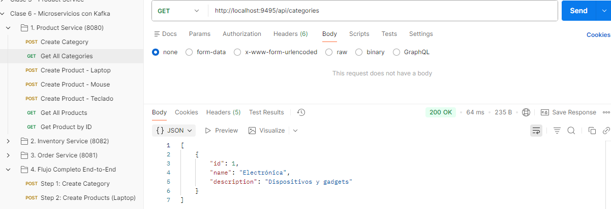
  
   - Creación de producto
  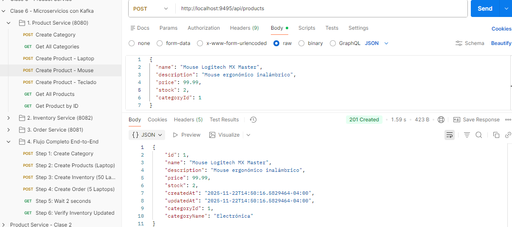
  
   - Lista productos
  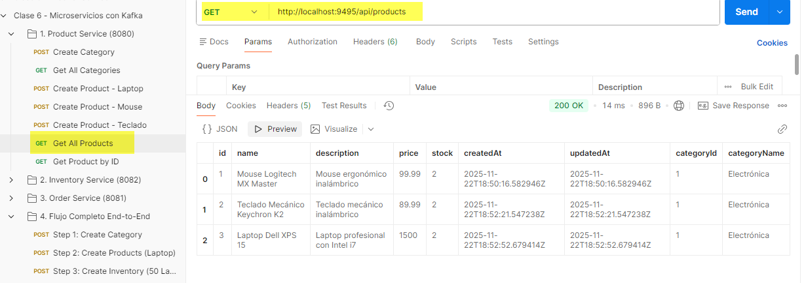
  
   -Lista producto por id
  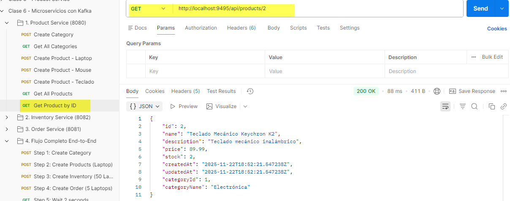

- **order-service**

	- Creación de orden de producto
	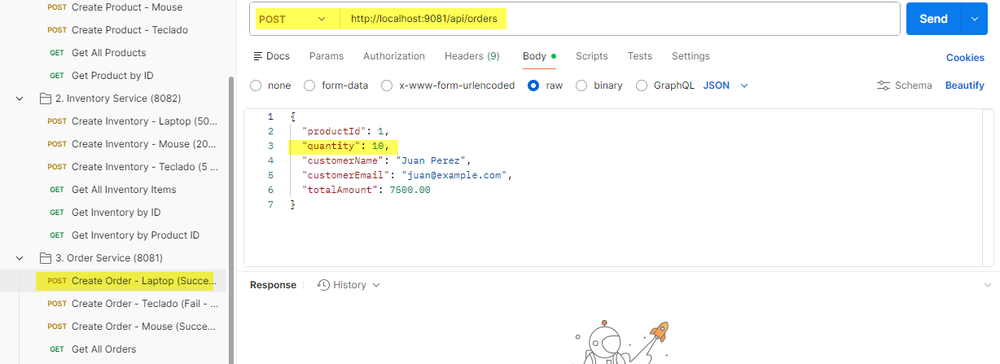


- **inventory-service**

 - Creación de inventario
 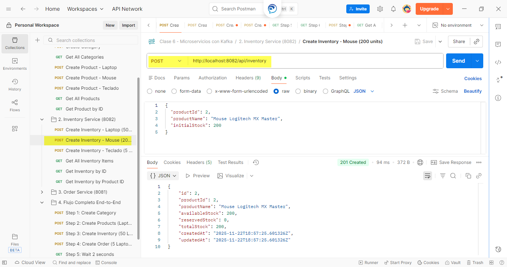

 - Lista todos los items inventarios
  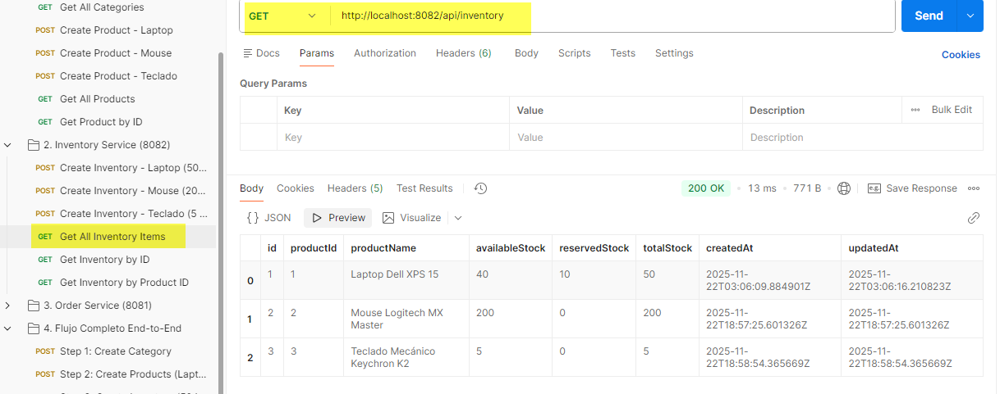
  
 - Lista inventario por producto 
  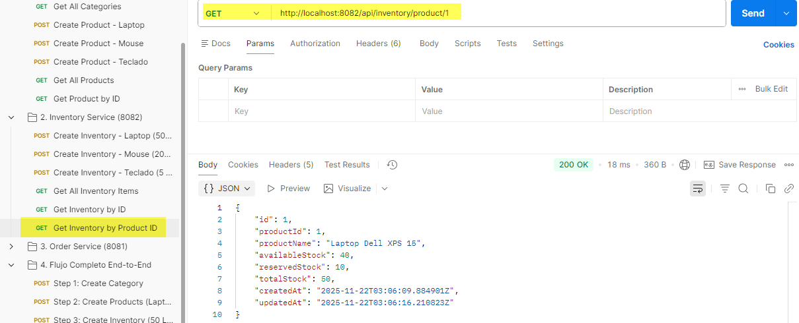
  
 - Lista inventario por id
  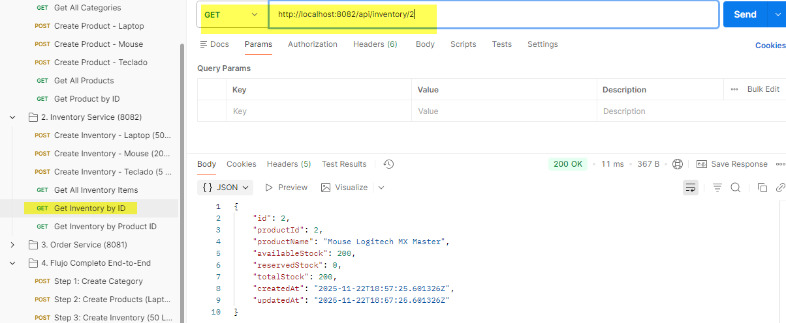 
 
 - Verifica actualización de inventario 
  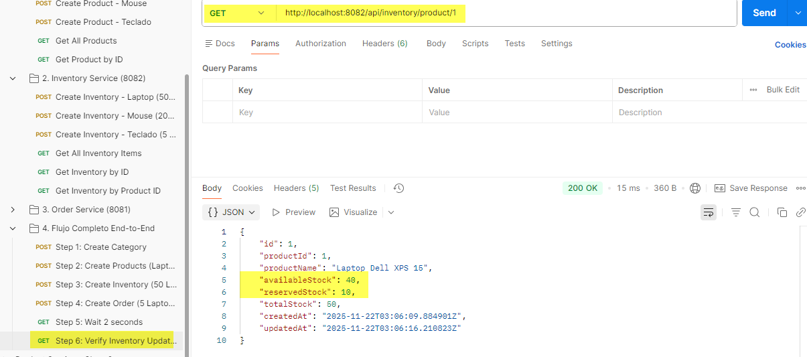 


- **Validaciones**
  - Crear archivo ValidationMessages.properties
  - Adicionar la dependencia en archivo pom.xml

		<dependency>
			<groupId>org.springframework.boot</groupId>
			<artifactId>spring-boot-starter-validation</artifactId>
		</dependency>

  - Actualizar el archivo application.yml

		spring:
		  messages:
			basename: ValidationMessages

  - Parametrizar las validaciones para order-service

		order.product.notblank=El ID del producto es requerido
		order.product.positive=El ID del producto debe ser positivo
		order.quantity.notblank =La cantidad es requerida
		order.quantity.positivew=La cantidad debe ser positiva
		order.quantity.max=La cantidad no puede exceder 100
		order.name.notblank=El nombre del cliente es requerido
		order.name.min=El nombre debe tener entre 3 y 100 caracteres
		order.email.notblank=El email del cliente es requerido
		order.email.email=El email debe ser válido
		order.totalAmount.notblank=El monto total es requerido
		order.totalAmount.positive=El monto total debe ser positivo


		public record OrderRequest(

				@NotNull(message = "{order.product.notblank}")
				@Positive(message = "{order.product.positive}")
				Long productId,

				@NotNull(message = "{order.quantity.notblank}")
				@Positive(message = "{order.quantity.positive}")
				@Max(value = 100, message = "{order.quantity.max}")
				Integer quantity,

				@NotBlank(message = "{order.name.notblank}")
				@Size(min = 3, max = 100, message = "{order.name.min}")
				String customerName,

				@NotBlank(message = "{order.email.notblank}")
				@Email(message = "{order.email.email}")
				String customerEmail,

				@NotNull(message = "{order.totalAmount.notblank}")
				@Positive(message = "{order.totalAmount.positive}")
				BigDecimal totalAmount

		) {
		}

	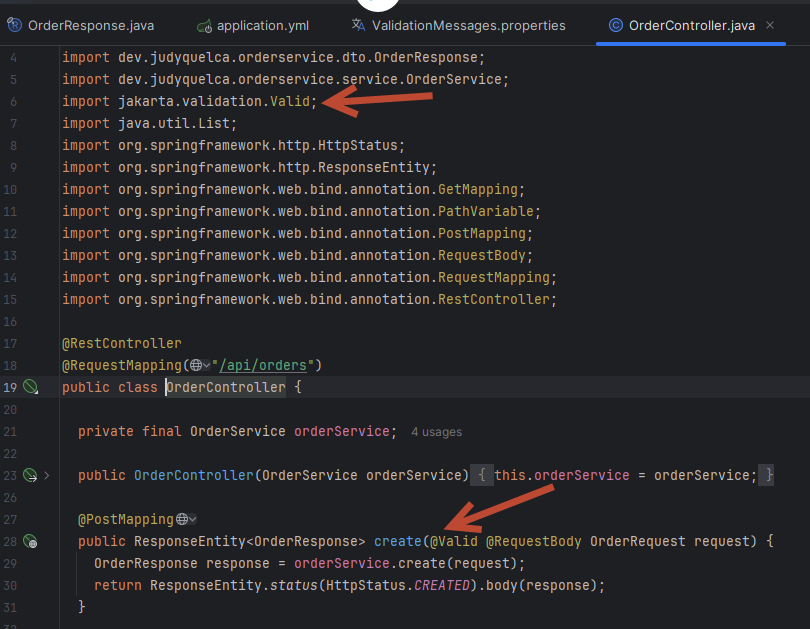


	- Validacion de inventoryservice
	
		inventory.product.notblank=El ID del producto es requerido
		inventory.product.name=El nombre del producto es requerido
		inventory.stock.notblank =El stock inicial es requerido
		inventory.stock.positive=El stock inicial debe ser no negativo

		public record InventoryItemRequest (

			@NotNull(message = "{inventory.product.notblank}")
			Long productId,

			@NotBlank(message = "{inventory.product.name}")
			String productName,

			@NotNull(message = "{inventory.stock.notblank}")
			@Min(value = 0, message = "{inventory.stock.positive}")
			Integer initialStock
		){
		}

 - **Adición de la clase GlobalExceptionHandler**

	- Crear las siguientes clases dentro del paquete exception
		- ErrorResponse.java
        - ResourceNotFoundException.java
		- GlobalExceptionHandler.java
		
    - Actualización para lanzar excepciones
        - OrderService.java

			  @Transactional(readOnly = true)
				public OrderResponse findById(Long id) {
					Order order = orderRepository.findById(id)
							.orElseThrow(() -> new OrderNotFoundException("Orden " + id + " no encontrado"));
					return OrderMapper.toResponse(order);
				}

		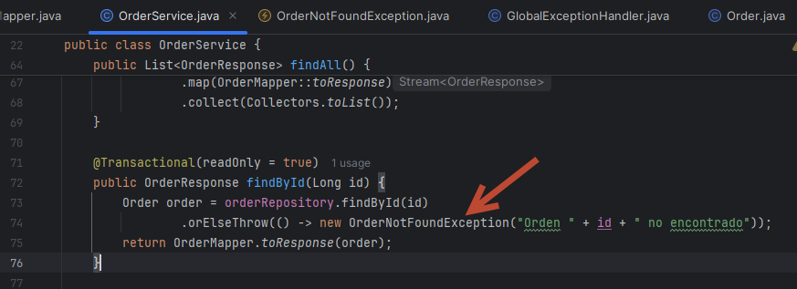

		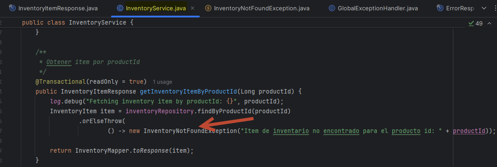


### Kafka

- Actualización de Topics (5 particiones, 1 réplica):
  - ecommerce.products.created
  - ecommerce.orders.placed
  - ecommerce.orders.confirmed
  - ecommerce.orders.cancelled
  
- Se verifica que Kafka está corriendo

	- docker compose ps
	- docker exec -it kafka bash

  - Actualmente esta es la lista topics existentes
     
	 - kafka-topics --bootstrap-server localhost:9092 --list
	 
    

			
	- Con los siguientes comandos se actualiza el número de Topics
  
		  kafka-topics --bootstrap-server localhost:9092 --alter --topic ecommerce.products.created --partitions 5
		  kafka-topics --bootstrap-server localhost:9092 --alter --topic ecommerce.orders.placed --partitions 5
		  kafka-topics --bootstrap-server localhost:9092 --alter --topic ecommerce.orders.confirmed --partitions 5
		  kafka-topics --bootstrap-server localhost:9092 --alter --topic ecommerce.orders.cancelled --partitions 5
		  kafka-topics --bootstrap-server localhost:9092 --alter --topic ecommerce.inventory.updated --partitions 5

		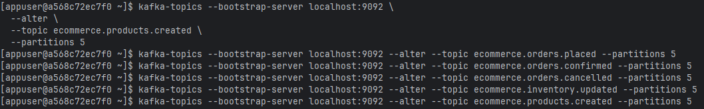
		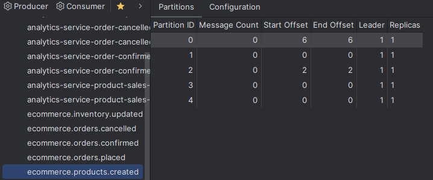
		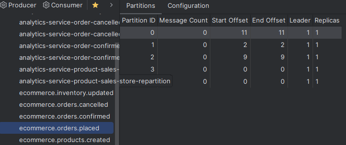
		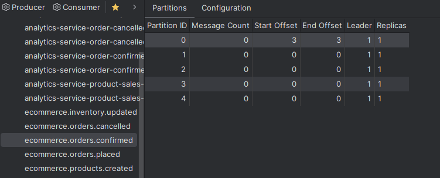
		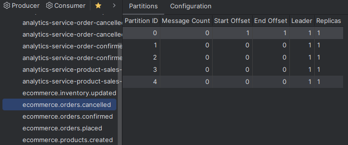
		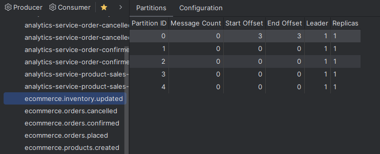

	- configuracion de kafka con `spring.kafka` y `spring.json.type.mapping`.
	
		- productservice
		  
		  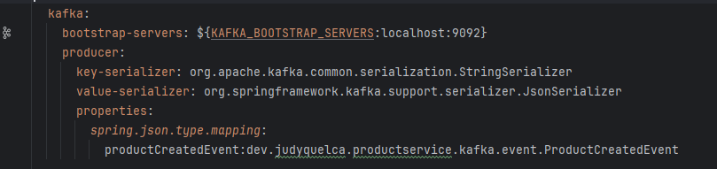

  
  
		- orderservice
		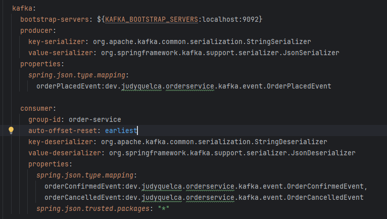
	  
		- inventoryservice
		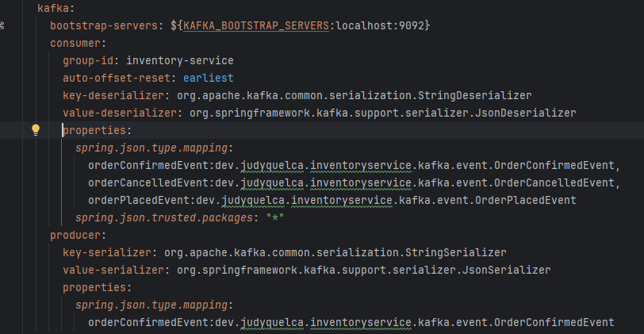
  
  
	-  flujo con lo que se obtuvo de postman  

		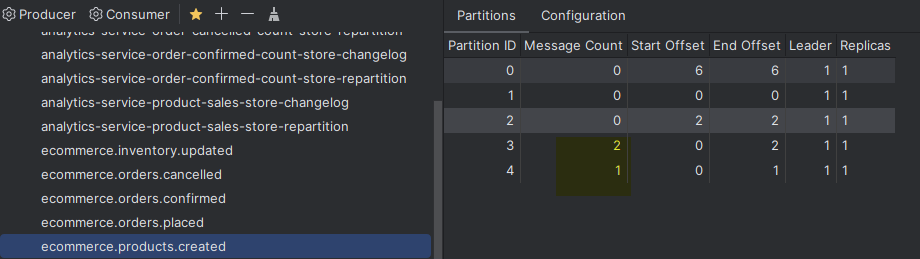
		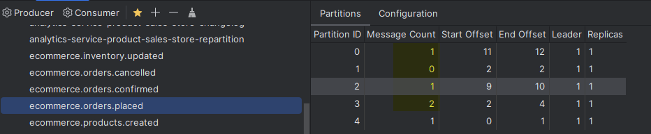
		

### Bases de datos y modelos

- Tres bases PostgreSQL (`ecommerce`, `ecommerce_orders`, `ecommerce_inventory`)

 - se crea con los siguientes script (desde la consola de postgres)
		CREATE DATABASE ecommerce;
		CREATE DATABASE ecommerce_orders;
		CREATE DATABASE ecommerce_inventory;

		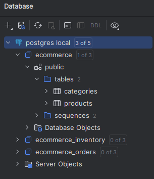

 - En el archivo doker-compose.yml se debe confifugurar lo siguiente 
 
	  postgres:
		image: postgres:15-alpine
		container_name: product-db
		restart: unless-stopped
		environment:
		  POSTGRES_DB: ecommerce
		  POSTGRES_USER: ecommerce_user
		  POSTGRES_PASSWORD: ecommerce_password
		ports:
		  - "5432:5432"
		volumes:
		  - postgres-data:/var/lib/postgresql/data

		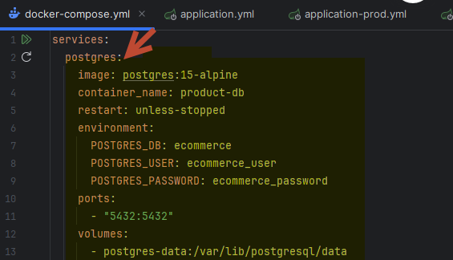
	
	- Adicionar en el archivo pom.xml, la dependencia
		<dependency>
			<groupId>org.postgresql</groupId>
				<artifactId>postgresql</artifactId>
				<scope>runtime</scope>
		</dependency>

		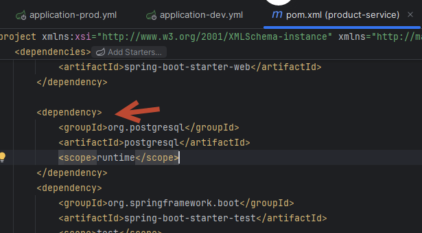

	- Entidades con relaciones correctas (Product–Category 1:N, etc.).
	- Documenta el modelo de datos (tabla o diagrama) y cualquier constraint relevante.

### Configuración y variables 

- Cada `application.yml` debe usar variables con fallback:

```yaml
spring:
  datasource:
    url: jdbc:postgresql://${DB_HOST:localhost}:${DB_PORT:5432}/${DB_NAME:ecommerce}
    username: ${DB_USER:postgres}
    password: ${DB_PASSWORD:postgres}
  kafka:
    bootstrap-servers: ${KAFKA_BOOTSTRAP_SERVERS:localhost:9092}
```

- Ajusta el `DB_NAME` por servicio (`ecommerce`, `ecommerce_orders`, `ecommerce_inventory`).
- Usa perfiles (`spring.profiles.active`) para dev/prod y documenta cómo activarlos.

---

## 4. Puntos Extra (Opcionales)

Suma hasta **+10 pts** si implementas y documentas alguno de estos extras.

1. **Perfiles avanzados (+5 pts)**: dev/test/prod con configuraciones diferenciadas (logging, Kafka, DB). Explica cómo se activa cada uno.
2. **Documentación API con Swagger (+5 pts)**: integra Springdoc/OpenAPI, documenta todos los endpoints y enlaza la URL (`/swagger-ui.html`) en el README.

> Los puntos extra se cuentan solo si están claramente explicados (qué hiciste, cómo se prueba, capturas o logs).

