# Proyecto Final · E-commerce con Spring Boot y Kafka

## Curso
- Curso Spring Boot & Kafka

## Nombre 
- Judith Sayda Quelca Nina  
- CI 4373568

## REPOSITORIOS
- ecommerce-product-service (9495)

https://github.com/judithquelca/ecommerce-product-service

- ecommerce-ecommerce-order-service (8081)

https://github.com/judithquelca/ecommerce-order-service

- ecommerce-inventory-service (8082)

https://github.com/judithquelca/ecommerce-inventory-service

### Arquitectura y estructura

#### Capas de cada servicio

- product-service

 

- order-service

 

- inventory-service

 

#### Archivos de configuración
- Los archivos de configuración que se tiene son los siguientes:

  - application.yml
  - application-dev.yml
  - application-prod.yml
  - ValidationMessages.properties

### Funcionalidad REST y validaciones

- **product-service**

  - creación de categoria
  
  
   - creación de producto
  
  
   - lista productos
  
  
   - búsqueda producto por id
  

- **order-service**

	- creación de orden de producto
	
	
	- lista ordenes
	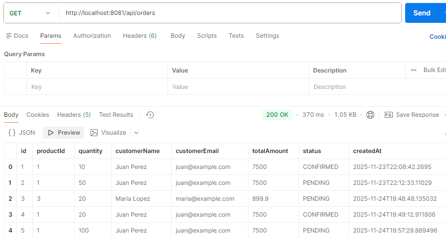	
	
	- búsqueda orden  por id
	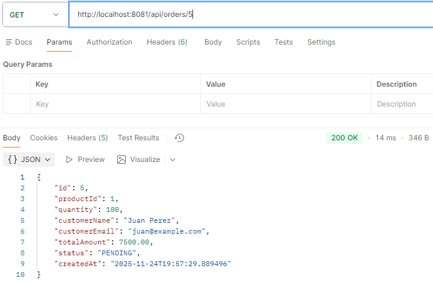	
	
	- estado PENDING/CONFIRMED/CANCELLED
	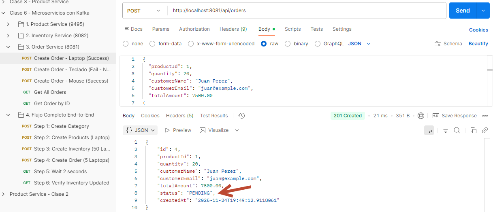
	
	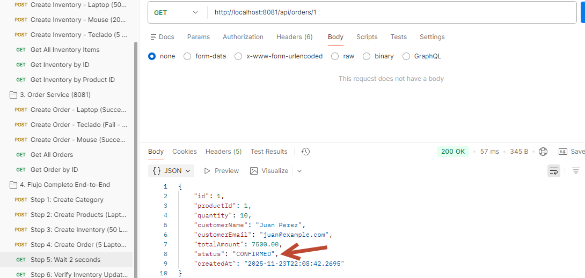	
	
	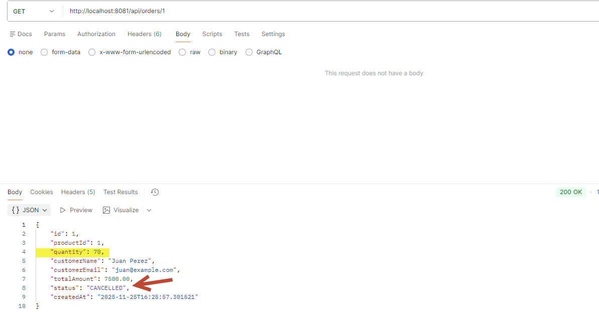

- **inventory-service**

 - creación de inventario
 

 - lista todos los items inventarios
  
  
 - búsqueda inventario por producto 
  
  
 - búsqueda inventario por id
   
 
 - verifica la actualización de inventario 
   

- **Validaciones**
  - Para las validaciones se realizo lo siguiente:

    - Crear el archivo de ValidationMessages.properties
  
    - Adicionar la dependencia en archivo pom.xml

		<dependency>
			<groupId>org.springframework.boot</groupId>
			<artifactId>spring-boot-starter-validation</artifactId>
		</dependency>

    - Actualizar el archivo application.yml

		spring:
		  messages:
			basename: ValidationMessages

    - Parametrizar las validaciones para order-service

		order.product.notblank=El ID del producto es requerido
		order.product.positive=El ID del producto debe ser positivo
		order.quantity.notblank =La cantidad es requerida
		order.quantity.positivew=La cantidad debe ser positiva
		order.quantity.max=La cantidad no puede exceder 100
		order.name.notblank=El nombre del cliente es requerido
		order.name.min=El nombre debe tener entre 3 y 100 caracteres
		order.email.notblank=El email del cliente es requerido
		order.email.email=El email debe ser válido
		order.totalAmount.notblank=El monto total es requerido
		order.totalAmount.positive=El monto total debe ser positivo

		public record OrderRequest(

				@NotNull(message = "{order.product.notblank}")
				@Positive(message = "{order.product.positive}")
				Long productId,

				@NotNull(message = "{order.quantity.notblank}")
				@Positive(message = "{order.quantity.positive}")
				@Max(value = 100, message = "{order.quantity.max}")
				Integer quantity,

				@NotBlank(message = "{order.name.notblank}")
				@Size(min = 3, max = 100, message = "{order.name.min}")
				String customerName,

				@NotBlank(message = "{order.email.notblank}")
				@Email(message = "{order.email.email}")
				String customerEmail,

				@NotNull(message = "{order.totalAmount.notblank}")
				@Positive(message = "{order.totalAmount.positive}")
				BigDecimal totalAmount

		) {
		}

	
	
	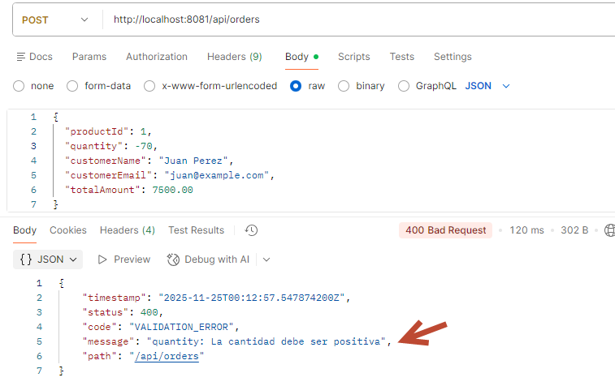

	- Parametrizar las validaciones para inventoryservice
	
		inventory.product.notblank=El ID del producto es requerido
		inventory.product.name=El nombre del producto es requerido
		inventory.stock.notblank =El stock inicial es requerido
		inventory.stock.positive=El stock inicial debe ser no negativo
		

		public record InventoryItemRequest (

			@NotNull(message = "{inventory.product.notblank}")
			Long productId,

			@NotBlank(message = "{inventory.product.name}")
			String productName,

			@NotNull(message = "{inventory.stock.notblank}")
			@Min(value = 0, message = "{inventory.stock.positive}")
			Integer initialStock
		){
		}

 - **Adición de la clase GlobalExceptionHandler**

	- Se creo las siguientes clases dentro del paquete exception
		- ErrorResponse.java
        - ResourceNotFoundException.java
		- GlobalExceptionHandler.java
		
    - Se actualizó la clase OrderService.java para lanzar excepciones
        
			  @Transactional(readOnly = true)
				public OrderResponse findById(Long id) {
					Order order = orderRepository.findById(id)
							.orElseThrow(() -> new OrderNotFoundException("Orden " + id + " no encontrado"));
					return OrderMapper.toResponse(order);
				}

		

		
		
		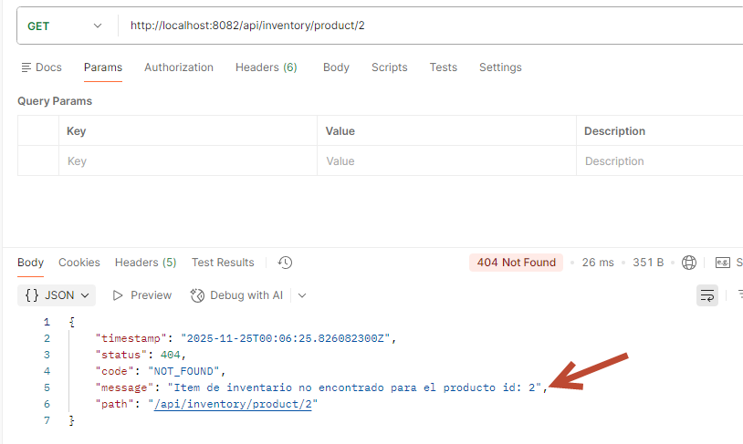
		
		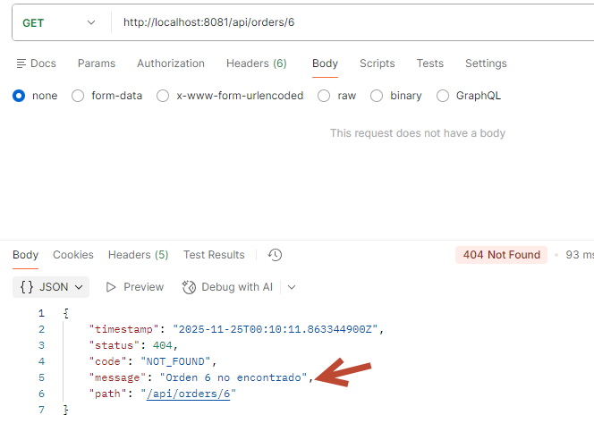

### Kafka

- Actualización de Topics (5 particiones, 1 réplica):
   - ecommerce.products.created
   - ecommerce.orders.placed
   - ecommerce.orders.confirmed
   - ecommerce.orders.cancelled
  
 - Verificación que Kafka este corriendo

	- docker compose ps
	- docker exec -it kafka bash

 - Actualmente esta es la lista topics existentes
     
	 - kafka-topics --bootstrap-server localhost:9092 --list
	 
    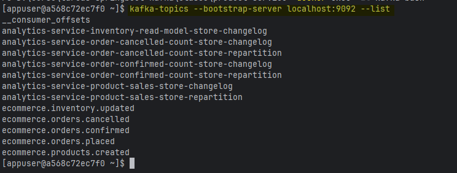

			
	- Con los siguientes comandos se actualiza el número de Topics
  
		  kafka-topics --bootstrap-server localhost:9092 --alter --topic ecommerce.products.created --partitions 5
		  kafka-topics --bootstrap-server localhost:9092 --alter --topic ecommerce.orders.placed --partitions 5
		  kafka-topics --bootstrap-server localhost:9092 --alter --topic ecommerce.orders.confirmed --partitions 5
		  kafka-topics --bootstrap-server localhost:9092 --alter --topic ecommerce.orders.cancelled --partitions 5
		  kafka-topics --bootstrap-server localhost:9092 --alter --topic ecommerce.inventory.updated --partitions 5

		
		
		
		
		
		
		
		
		
		
		

  - Configuración de kafka con `spring.kafka` y `spring.json.type.mapping`.
	
	- productservice
		
		
		  
		  
  
	- orderservice
		
		
	  
	- inventoryservice
		
		
  
  
-  Flujo con lo que se obtuvo de postman  

	
		
	
		
	
		
	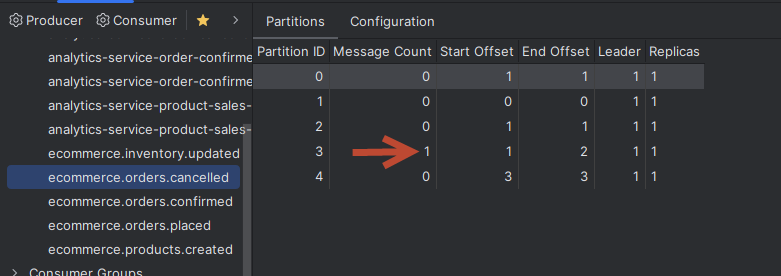
	
	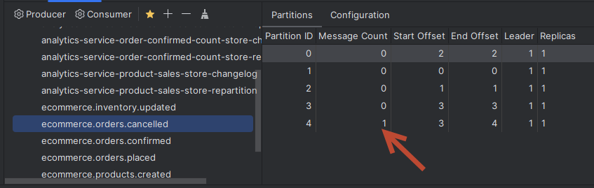	
		

### Bases de datos y modelos

- Tres bases PostgreSQL (`ecommerce`, `ecommerce_orders`, `ecommerce_inventory`)

 - Se crea la BD con los siguientes script (desde la consola de postgres)
 
		CREATE DATABASE ecommerce;
		CREATE DATABASE ecommerce_orders;
		CREATE DATABASE ecommerce_inventory;

	

 - En el archivo doker-compose.yml se debe configurar lo siguiente: 
 
		  postgres:
			image: postgres:15-alpine
			container_name: product-db
			restart: unless-stopped
			environment:
			  POSTGRES_DB: ecommerce
			  POSTGRES_USER: ecommerce_user
			  POSTGRES_PASSWORD: ecommerce_password
			ports:
			  - "5432:5432"
			volumes:
			  - postgres-data:/var/lib/postgresql/data

	
	
 - Se adiciona en el archivo pom.xml, la siguiente dependencia
 
		<dependency>
			<groupId>org.postgresql</groupId>
				<artifactId>postgresql</artifactId>
				<scope>runtime</scope>
		</dependency>

	

- Entidades con relaciones Product–Category 1:N
	
	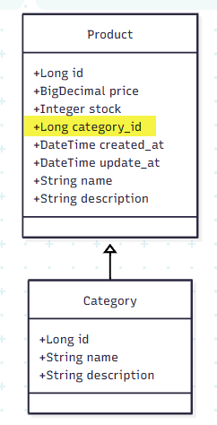
	
	
- Diagrama con los tres microservicios con kafka
	
	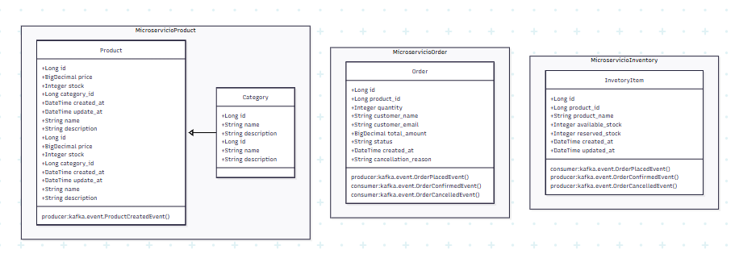	
	

### Configuración y variables 

- En el archivo `application.yml` se tiene las variables para ser parametrizadas como variables de entorno

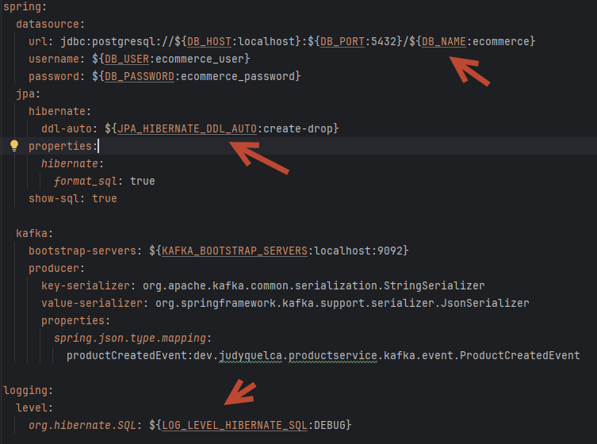

- Configuración de variables de entorno

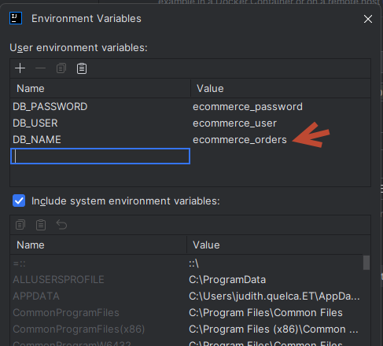

- Entorno de desarrollo

- Se activa desde la siguiente opción: profiles.active

- Al momento de ejecutar la aplicación se puede verificar en los logs

